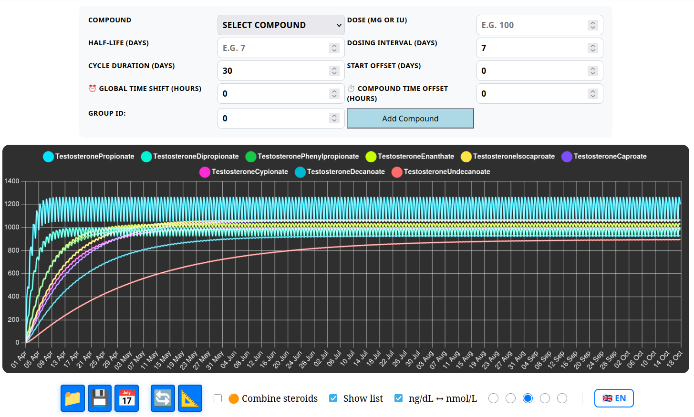
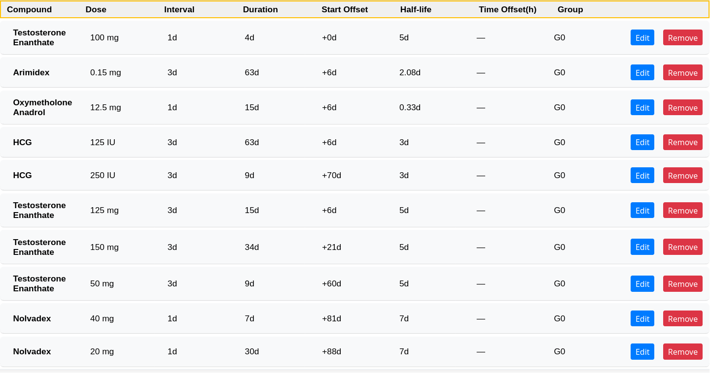
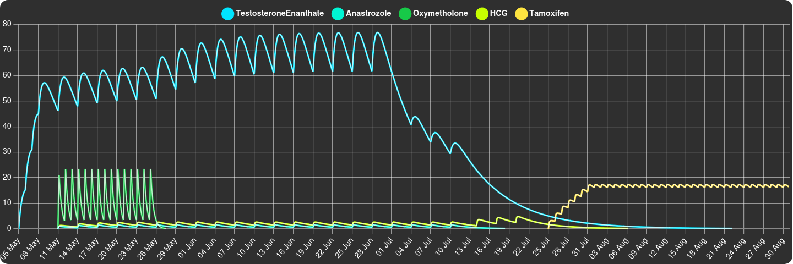

# Steroid Cycle Plotter

***

***

***

## Overview

Steroid Cycle Plotter is a web-based tool designed to help users plan, visualize, and analyze steroid cycles. The application models the pharmacokinetics of various steroid esters by displaying concentration curves based on dosage, half-life, dosing intervals, and cycle duration. It supports multiple compounds with individual pharmacokinetic parameter adjustments.

## Features

- Includes popular steroid esters: Testosterone Propionate, Enanthate, Nandrolone Decanoate, Trenbolone Acetate, HCG, plus a Custom mode.
- Interactive form to add compounds with customizable dose, half-life, interval, duration, and dosing start offset.
- Individual control of absorption rate multiplier (kaMultiplier), elimination rate modifier (keModifier), and concentration multiplier for each compound.
- Ability to combine all compounds into a single concentration curve, accurately accounting for individual multipliers.
- Dynamic, zoomable, and interactive concentration graph using Chartjs.
- Import/export cycle protocols as JSON files preserving all compound parameters.
- Responsive UI with validation and user-friendly alerts.

## Usage

1. Open `index.html` in a modern browser with JavaScript enabled.
2. Select the cycle start date.
3. Add compounds using the form, specifying dose, half-life, dosing interval, cycle length, and start offset.
4. Click **Add Compound** to include or **Update Compound** to edit an existing one.
5. Toggle the checkbox to combine compounds on the graph or view separately.
6. Export your protocol to a JSON file or import one to restore saved cycles.
7. Use buttons to update or reset the zoom on the graph.

## Pharmacokinetic Model

### Elimination rate constant (kₑ)

This constant represents how quickly the drug is eliminated from the body. It is calculated by dividing the natural logarithm of 2 (approximately 0.693) by the compound's half-life (the time for the drug concentration to reduce by half), then multiplying by an elimination rate modifier specific to each compound.

\[
k_e = \left(\frac{\text{natural logarithm of 2}}{\text{half-life}}\right) \times keModifier
\]

- *Natural logarithm of 2* (~0.693) reflects the half-life decay concept.
- *Half-life* is the time during which the drug concentration reduces to half.
- *keModifier* adjusts the elimination speed per compound.

### Absorption rate constant (kₐ)

Defines the rate at which the drug is absorbed into the bloodstream. It is computed by multiplying the elimination rate constant \(k_e\) by an absorption multiplier unique to each compound.

\[
k_a = k_e \times kaMultiplier
\]

- \(k_e\): elimination rate constant described above.
- *kaMultiplier*: coefficient adjusting the absorption speed.

These constants together determine the pharmacokinetic profile, balancing how fast a drug enters and leaves the bloodstream, enabling accurate simulation of concentration over time.

## Technical Details

- Uses Chartjs for interactive and animated graphs.
- Client-side JavaScript with no backend required.
- JSON import/export format supports full parameter preservation.
- User interface supports compound listing with edit and remove functions.

## Notes

- This tool uses simplified pharmacokinetic models with approximate parameters.
- It is not medical advice; always consult healthcare professionals before any treatment changes.
- Parameters can be customized to simulate different scenarios, but results are approximate.

---

For more info, visit the [GitHub repository](https://github.com/Alex2269/SteroidCyclePlotter).

